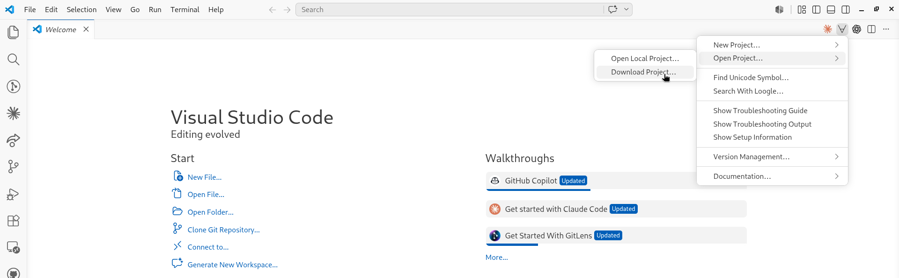
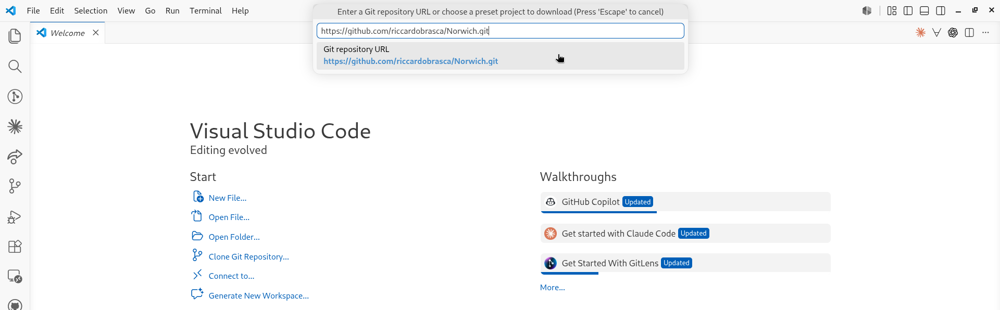
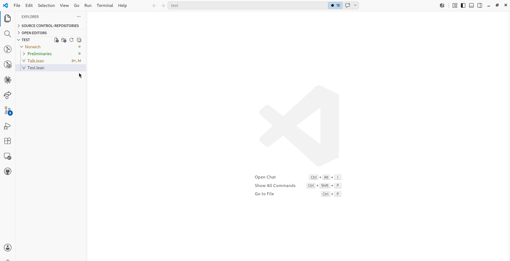
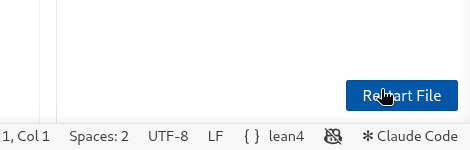

# Norwich

This is the repository for the talk *Algebraic Number Theory in Lean* given in Norwich.

* All the files needed during the talk are in the subfolder `Norwich`. See below for the instructions to install everything you need.

## Installation

Note: to get this repository, you will need to download Lean's mathematical library, which takes about 5 GB of storage space.

* You have to install Lean, and two supporting programs: Git and VSCode (including the Lean4 extension). Follow these [instructions](https://lean-lang.org/install/) to do this. You do not have to follow the last step (creating Lean projects). Instead, use either VSCode or a terminal to get this repository.

### Get the Repository using VSCode

* Open Visual Studio Code.

* In the top-right (or top-middle) of the screen there is a Lean menu marked by `∀`.
  In it, choose `Open Project... > Project: Download Project`. If you don't see the `∀`, the Lean extension is not installed, go back to the previous step or ask for help.

  
* Type
  ```
  https://github.com/riccardobrasca/Norwich.git
  ```
  and press enter (note that VSCode suggests you to download mathlib, that is *not* this repository).

  
* Choose a name for the folder where you want to have this repository (for example `Norwich`).
  This downloads the project, including mathlib, and will take a bit of time.
* Press `Open Project Folder` when asked if you want to open the folder.
* If VSCode asks `Do you trust the authors of the files in this folder?` click `Yes, I trust the authors`.
* Open the file `Norwich/Test.lean` using the explorer button in the top-left.
  
* VSCode will pause for a bit (10-40 seconds, depending on your computer), showing a `Starting Lean language client` pop-up.
* When the pop-up `Imports of 'Test.lean' are out of date and must be rebuilt.` appears, click on `Restart File` and wait a couple of seconds (this part should be very quick).
  
* Everything should be ready now. If you see a blue squiggle under `#eval`, Lean is running correctly.

### Get the Repository using a terminal

* Open a terminal (I recommend `git bash` on Windows, which was installed as part of git in the first step).

* Use `cd` to navigate to a directory where you would like to create the `Norwich` folder.

* Run the following three commands.
  ```
  git clone https://github.com/riccardobrasca/Norwich.git
  ```
  ```
  cd Norwich
  ```
  ```
  lake exe cache get!
  ```
  The last one downloads mathlib, and will take a bit of time.
* On Windows, if you get an error that starts with `curl: (35) schannel: next InitializeSecurityContext failed` it is probably your antivirus program that doesn't like that we're downloading many files. The easiest solution is to temporarily disable your antivirus program.

* Run
  ```
  lake build
  ```
  This should take less than 1 minute. If you get more than a few lines of output, then you're rebuilding Mathlib from scratch, which means that one of the steps above (`lake exe cache get!`) went wrong. You can quit the execution (by typing `Ctrl c`) and ask for help.

* Launch VS Code, either through your application menu or by typing (note the dot!)
  ```
  code .
  ```
   MacOS users need to take a one-off
  [extra step](https://code.visualstudio.com/docs/setup/mac#_launching-from-the-command-line)
   to be able to launch VS Code from the command line.

* If you launched VS Code from a menu, on the main screen, or in the File menu,
  click "Open folder" (just "Open" on a Mac), and choose the folder
  `Norwich` (*not* one of its subfolders).

* If VSCode asks `Do you trust the authors of the files in this folder?` click `Yes, I trust the authors`

* Test that everything is working by opening `Norwich/Test.lean`.
  It is normal if it takes 10-40 seconds for Lean to start up.

* Everything should be ready now. If you see a blue squiggle under `#eval`, Lean is running correctly.

### Update the repository

If you have already followed the steps above, and want to update the repository, open a terminal in your local copy of this repository (e.g. `cd Norwich`) and then run
```
git pull
```
This gives you the new exercises.

### Error Lens extension

Optional: some users find it useful to download the `Error Lens` extension. This displays Lean messages directly in your source file.
To get it, in the left bar of VSCode, click on the `Extensions` button (4-th or 5-th button), and search and install the extension `Error Lens`. It will start automatically.

## Alternative ways to use Lean

You can use Codespaces if you have trouble installing Lean locally. These work fine, but not as well as a locally installed copy of Lean.

### Using Codespaces

You can temporarily play with Lean using Github Codespaces. This requires a Github account, and you can only use it for a limited amount of time each month. If you are signed in to Github, click here:

<a href='https://codespaces.new/riccardobrasca/Norwich' target="_blank" rel="noreferrer noopener"></a>

* Make sure the Machine type is `4-core`, and then press `Create codespace`
* After 1-2 minutes you see a VSCode window in your browser. However, it is still busily downloading mathlib in the background, so give it another few minutes (5 to be safe) and then open a `.lean` file to start.

To restart a previous codespace, go to [https://github.com/codespaces/](https://github.com/codespaces/).

## Troubleshooting

If you get the error `unknown package 'Mathlib'` and a red squiggle under `import Mathlib.Tactic` then you probably didn't open the right folder (what you see might be slightly different from the screenshot below depending on the extensions you have installed, but the red squiggle shouldn't be there).
* Make sure to select `File/Open Folder` (*not* `File/Open File`) and to select the root folder called `Norwich` (or the name you chose during the installation). Note that this folder contains another folder also called `Norwich`: you have to select the first one (*not* the one `Norwich/Norwich`).
* If the error persists you can use Codespaces as described above and ask for help.
